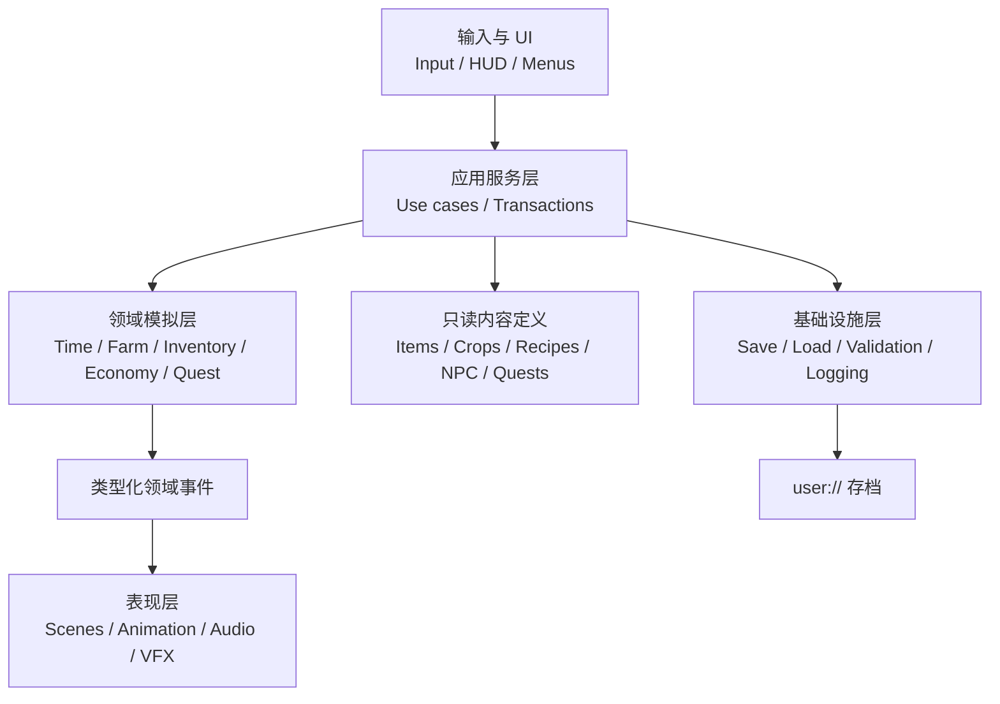
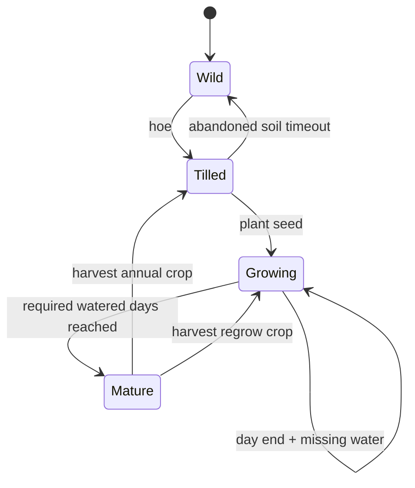

# 《溪谷新芽》（项目代号）技术设计文档

> 文档版本：0.3<br>
> 状态：已同步 PRD 0.3 并解决二次复查问题；可作为 M0–M3 实施基线，正式建项前需锁定 Godot 具体小版本<br>
> 专业起草角色：🎮 `gameplay`<br>
> 技术质量负责人：🧱 `tech`<br>
> 独立可测性审查：🛡️ `quality`<br>
> 产品依据：[PRD.md](PRD.md)

## 1. 技术目标

构建一个数据驱动、可保存、可测试的单人 2D 农场生活模拟垂直切片。优先保证：

1. 农耕和库存交易不会因帧率、切图或 UI 状态产生数据错误。
2. 作物、物品、配方、任务和经济数值可以不修改代码地调整。
3. 存档从第一版开始具备版本、备份与迁移入口。
4. 系统之间通过明确服务和领域事件协作，不互相直接修改内部状态。
5. 初学者能够通过清晰目录、短脚本和调试工具理解项目。

## 2. 技术决策

| 项目 | 决策 |
|---|---|
| 引擎 | Godot 4.x 稳定版，锁定项目开始时选定的具体小版本 |
| 语言 | 强类型 GDScript |
| 渲染 | Godot 2D Compatibility 渲染器；仅在有性能证据时改用其他渲染器 |
| 内部分辨率 | 480×270，整数缩放至 960×540、1440×810、1920×1080 |
| 基础地块 | 24×24 像素 |
| 内容格式 | 自定义 Godot `Resource`（`.tres`）作为权威设计数据 |
| 存档格式 | 带版本的 JSON DTO；禁止直接序列化 Godot 引擎类型 |
| 测试 | 纯 GDScript 头部运行器，不强制外部测试插件 |
| 联网 | 垂直切片无联网依赖 |
| 目标帧率 | 60 FPS |
| 确定性 | 每个随机子系统使用独立、可保存的随机流 |

具体 Godot 小版本必须写入 `project.godot` 和构建说明，团队不得在开发中静默升级。

## 3. 架构概览



依赖规则：

- 表现层可以读取领域状态，不得成为作物、库存、货币或任务的权威数据源。
- 领域层不引用具体 UI、音频和 TileMap 节点。
- 内容定义为只读；运行状态和定义分离。
- 所有物品与货币变化通过应用服务的原子交易完成。
- 全局信号仅传递已定义事件，不用字符串作为业务协议。

## 4. 项目目录

```text
/
├── project.godot
├── assets/
│   ├── art/
│   │   ├── characters/
│   │   ├── environment/
│   │   ├── items/
│   │   ├── ui/
│   │   └── vfx/
│   └── audio/
│       ├── music/
│       ├── ambience/
│       └── sfx/
├── content/
│   ├── crops/
│   ├── items/
│   ├── recipes/
│   ├── quests/
│   ├── characters/
│   ├── dialogue/
│   ├── schedules/
│   ├── shops/
│   ├── scenarios/
│   ├── events/
│   ├── weather/
│   ├── world/
│   │   └── gather_nodes/
│   └── economy/
├── scenes/
│   ├── bootstrap/
│   ├── player/
│   ├── world/
│   ├── farm/
│   ├── npc/
│   ├── interactables/
│   └── ui/
├── src/
│   ├── core/
│   ├── application/
│   ├── domain/
│   ├── presentation/
│   ├── infrastructure/
│   └── debug/
├── tests/
│   ├── unit/
│   ├── integration/
│   ├── fixtures/
│   └── run_tests.gd
└── docs/
    └── game/
```

资源名称、文件夹和稳定 ID 使用小写 `snake_case`。显示名称通过本地化键解析。

## 5. 运行时组成

### 5.1 Bootstrap

启动场景职责：

1. 初始化日志和内容注册表。
2. 加载并验证所有设计数据。
3. 初始化设置和输入映射。
4. 创建新游戏或载入存档。
5. 通过 `SceneRouter` 进入农舍或目标地图。

关键内容验证失败时，开发构建停止进入游戏并列出资源路径与错误字段；发布构建显示可恢复错误页面。

### 5.2 Autoload

仅允许以下长期服务成为 Autoload：

| 服务 | 职责 |
|---|---|
| `GameKernel` | 组合应用服务、持有当前会话引用 |
| `SceneRouter` | 地图切换、加载遮罩和出生点协议 |
| `SaveService` | 存档读写、备份、版本与迁移 |
| `SettingsService` | 音量、显示、输入和无障碍设置 |
| `AudioRouter` | 音乐、环境和 UI/SFX 总线切换 |

`ClockSystem`、`InventoryService`、`EconomyService` 和 `RandomStreamService` 等属于游戏会话，不作为永久全局单例，避免新游戏时残留状态。`RandomStreamService` 只读写当前 `GameSession.RandomState`。

## 6. 领域模型

### 6.1 稳定 ID

- 格式：`namespace.category.name`，例如 `brookseed.crop.mist_radish`。
- ID 一经进入公开存档不可重用。
- 重命名通过迁移映射完成，不能直接修改旧 ID。
- 运行逻辑只保存 ID 和状态，不保存显示名称。

### 6.2 内容定义

#### `ItemDefinition`

| 字段 | 类型 | 说明 |
|---|---|---|
| `id` | `StringName` | 稳定 ID |
| `name_key` | `StringName` | 本地化键 |
| `category` | enum | crop、material、tool、food、quest 等 |
| `stack_limit` | int | 1–999 |
| `base_sell_price` | int | 非负整数 |
| `icon` | Texture2D | 原创图标 |
| `tags` | Array[StringName] | 配方、订单和过滤 |

#### `CropDefinition`

| 字段 | 类型 | 说明 |
|---|---|---|
| `id` | `StringName` | 作物稳定 ID |
| `seed_item_id` | `StringName` | 种子物品 |
| `harvest_item_id` | `StringName` | 收获物 |
| `stage_days` | `PackedInt32Array` | 各阶段所需已浇水日 |
| `valid_seasons` | Array[enum] | 可生长季节 |
| `yield_min` | int | 最低收获数量 |
| `yield_max` | int | 最高收获数量，且不得小于 `yield_min` |
| `regrow_days` | int | 0 表示不重复收获 |
| `water_need` | int | MVP 使用 0/1 |
| `sprite_set` | Resource | 阶段视觉资源 |

#### `NewGameScenarioDefinition`

使用稳定场景 ID 配置新游戏和可重复验收的初始状态，禁止把教学资源写死在场景脚本中。

| 字段 | 类型 | 说明 |
|---|---|---|
| `id` | `StringName` | 新游戏场景稳定 ID |
| `start_day` | int | 初始游戏日 |
| `start_time` | GameTime | 初始时间，VS-0 为 06:30 |
| `starting_currency` | int | VS-0 为 720 |
| `starting_inventory_capacity` | int | VS-0 为 16 |
| `starting_items` | Array[InitialItemStack] | 基础工具、8 份雾萝卜种子、4 份溪叶菜种子 |
| `starting_farm_cells` | Array[InitialFarmCell] | 包含 3 株成熟雾萝卜的教学地块 |
| `starting_npc_spawns` | Array[InitialNpcSpawn] | 水工学徒在 VS-0 期间位于农场入口 |
| `starting_recipe_ids` | Array[StringName] | 木箱、小径、堆肥架和水渠接片 |
| `guaranteed_gather_node_ids` | Array[StringName] | 指向 VS-1 保底材料节点 |
| `scripted_weather_by_day` | Dictionary[int, enum] | VS-1 第 2 天固定为雨天 |
| `scripted_event_by_day` | Dictionary[int, StringName] | VS-1 第 2 天固定触发一次社区消息事件 |

`InitialItemStack` 只包含稳定物品 ID 与数量；`InitialFarmCell` 只包含坐标、作物稳定 ID、阶段和浇水状态；`InitialNpcSpawn` 只包含 NPC ID、地图 ID 和出生点 ID。`ContentRegistry` 必须验证教学地块坐标不重复、作物引用存在且标记为成熟、初始物品不超出背包容量、引导 NPC 与采集节点可达，并确认脚本化日程覆盖 PRD 第 14 节所需的 3 个游戏日。

#### `RecipeDefinition`

包含稳定 ID、输入物品列表、输出物品、解锁条件、工作站标签和放置物定义。

#### `ShopDefinition`

包含商店稳定 ID、商人 NPC ID、营业条件和 `ShopListingDefinition` 列表。每条商品记录物品 ID、单价、库存上限、刷新规则和解锁条件。VS-1 的种源商店必须从第 2 天起以 62 溪票出售琥珀豆种子。

#### `DialogueDefinition`

包含稳定对话 ID、文本键、说话角色、条件化选项、动作 ID、下一节点和结束节点。显示文本不得承担逻辑判断；社区消息选项只提交稳定行动 ID。

#### `ScheduleDefinition`

包含角色 ID、日期/天气条件、时间段、地图 ID、出生点 ID 和回退位置。内容验证必须拒绝重叠时间段和不存在的地图或出生点。

#### `GatherNodeDefinition`

包含稳定 ID、地图与坐标、交互工具、确定性保底产出、可选随机产出、刷新规则和一次性标记。VS-1 的保底节点总产出固定为溪木 ×14、苔石 ×12、芦纤维 ×12。

#### `WeatherDefinition`

包含稳定天气 ID、视觉层、环境音、本地化键和农田规则修饰。脚本化天气与随机天气都引用同一内容定义。

#### `WatershedContributionDefinition`

| 字段 | 类型 | 说明 |
|---|---|---|
| `id` | `StringName` | 一次性贡献稳定 ID |
| `source_event_id` | `StringName` | 允许触发贡献的领域事件 |
| `points` | int | 非负复苏点 |
| `prerequisite_ids` | Array[StringName] | 放置、任务或世界前置 |
| `one_time` | bool | VS-1 必须为 true |

VS-1 固定注册 `place_canal_segment = 12` 和 `deliver_canal_repair = 8`。社交奖励 `correct_d_bonus = 2` 是额外贡献，内容验证不得把它计入主线保底 20 点。

#### `QuestDefinition`

包含稳定 ID、文本键、前置条件、目标列表、奖励、完成后的领域事件、一次性标记，以及可选的 `min_standing`。该字段只允许用于可选奖励或额外对白节点；水渠主线关键路径使用时必须被内容验证拒绝。

#### `NpcDefinition`

| 字段 | 类型 | 说明 |
|---|---|---|
| `id` | `StringName` | 角色稳定 ID |
| `name_key` | `StringName` | 本地化键 |
| `role` | enum | `quest_giver`（职能角色）、`neighbor`（邻居角色） |
| `personality_archetype` | enum / empty | 仅邻居使用：`helpful_hearsay`、`dramatic_storyteller`、`evidence_minded`、`consensus_follower` |
| `dialogue_pool_id` | `StringName` | 对话树引用 |
| `schedule_id` | `StringName` | 日程与出现地点引用 |
| `portrait` | Texture2D | 原创头像 |

三名职能角色与四名邻居共享同一个 `NpcDefinition` 结构；邻居额外通过 `GossipEventDefinition` 关联社交事件。

#### `GossipEventDefinition`

| 字段 | 类型 | 说明 |
|---|---|---|
| `id` | `StringName` | 事件稳定 ID |
| `claim_id` | `StringName` | 指向 `GossipClaimDefinition` |
| `trigger_npc_id` | `StringName` | 发起邻居 |
| `cooldown_days` | int | 完整产品触发冷却 2–3；VS-1 由脚本化日程固定在第 2 天触发 |
| `deadline_offset_days` | int | VS-1 为 1，即第 2 天触发、第 3 天 23:30 截止 |
| `prerequisite_ids` | Array[StringName] | 事件出现前置条件 |
| `action_ids` | Array[StringName] | 指向可用行动定义 |

#### `GossipClaimDefinition`

| 字段 | 类型 | 说明 |
|---|---|---|
| `id` | `StringName` | 谣言事实稳定 ID |
| `rumor_text_key` | `StringName` | 未核实时显示的说法 |
| `verified_text_key` | `StringName` | 核实后显示的事实 |
| `target_npc_id` | `StringName` | 被波及的职能角色 |
| `relay_npc_id` | `StringName` | 传播或需要纠正的邻居，垂直切片为阿棉 |
| `verification_rule_id` | `StringName` | 指向条件组；可表达“证据条件或背书标记任一满足” |

#### `GossipActionDefinition`

| 字段 | 类型 | 说明 |
|---|---|---|
| `id` | `StringName` | 行动稳定 ID |
| `choice_text_key` | `StringName` | 选择文本键 |
| `interaction_selector` | enum | `trigger_npc` 或 `fixed_npc` |
| `fixed_npc_id` | `StringName` | 固定交互角色；老耿或阿棉，其他情况为空 |
| `required_event_status` | enum | 提交前必须满足的事件状态 |
| `condition_group_id` | `StringName` | 可观察证据等附加条件，可为空 |
| `standing_delta` | int | 社区风评变化 |
| `relationship_effect_id` | `StringName` | 由 `RelationshipService` 解释的效果定义 |
| `quest_effect_id` | `StringName` | 由 `QuestService` 解释的效果定义，可为空 |
| `watershed_effect_id` | `StringName` | 由 `WatershedService` 解释的效果定义，可为空 |
| `reward_policy` | enum | `apply_configured` 或 `watershed_else_relationship` |
| `next_status` | enum | 行动提交后的事件状态 |

#### `ConditionGroupDefinition`

| 字段 | 类型 | 说明 |
|---|---|---|
| `id` | `StringName` | 条件组稳定 ID |
| `mode` | enum | `all` 或 `any` |
| `condition_ids` | Array[StringName] | 指向物品数量、世界标记、背书标记或事件状态条件 |

#### `RelationshipEffectDefinition`

| 字段 | 类型 | 说明 |
|---|---|---|
| `id` | `StringName` | 效果稳定 ID |
| `target_selector` | enum | 谣言目标角色或固定角色 ID |
| `zero_growth_today` | bool | 是否让行动提交后的当日后续增长归零 |
| `first_talk_multiplier_bp` | int | 万分比倍率；误会期 0.50 写为 5000 |
| `first_talk_start_offset_days` | int | 首次交谈倍率从几天后开始；VS-1 误会效果为 1 |
| `duration_days` | int | 从开始日计算的持续天数；VS-1 误会效果为 1 |
| `flat_bonus_subpoints` | int | 一次性信任子点；+3.00 写为 300 |
| `stack_policy` | enum | `replace`、`max` 或 `reject` |

内容启动验证必须确认所有定义引用存在、行动状态转换合法、`verify_with_c` 指向有效证据条件、`correct_d` 要求 `verified`，并且截止时间、效果持续时间和倍率处于允许范围。

VS-1 的基线内容配置固定为：

| 行动 ID | 风评变化 | 关系/任务效果 |
|---|---:|---|
| `relay_unverified` | −8 | `offered → resolved_relay`；提交后当日后续增长归零，次日首次交谈 ×0.50 |
| `defer_judgment` | 0 | `offered → deferred`；截止时 `deferred → expired` |
| `start_verification` | 0 | `offered → investigating` |
| `verify_with_c` | 0 | 满足证据后 `investigating → verified` |
| `correct_d` | +8 | `verified → resolved_corrected`；水脉 +2，若目标已完成则信任 +300 子点 |

老耿的一步核实目标完成时风评 +5 并设置 `c_endorsement_unlocked`。所有数值来自内容数据，测试夹具必须从同一配置读取，不能在测试代码中复制常量。

### 6.3 运行状态

```text
GameSession
├── scenario_id: StringName
├── CalendarState
├── PlayerState
│   ├── TransformState
│   ├── StaminaState
│   └── InventoryState
├── FarmState
│   └── Dictionary<Vector2i, FarmCellState>
├── EconomyState
│   ├── balance: int
│   ├── shipping: ShippingState
│   └── settlement_history: Array[SettlementRecord]
├── QuestState
├── RelationshipState
│   ├── trust_subpoints: Dictionary<StringName, int>
│   ├── multiplier_remainders: Dictionary<StringName, int>
│   └── active_effects: Array[RelationshipEffectState]
├── CommunityState
│   ├── standing: int
│   ├── neighbor_states: Dictionary<StringName, NeighborState>
│   ├── active_gossip_events: Array[GossipEventState]
│   └── gossip_event_history: Array[GossipEventState]
├── RandomState
│   └── streams: Dictionary<StringName, RandomStreamState>
├── WatershedState
└── WorldState
```

`NeighborState` 记录单个邻居的运行数据：`stance`（仅阿棉使用：`neutral`/`relaying_unverified`/`relaying_verified`）、`gossip_cooldown_until_day`、`c_endorsement_unlocked`（老耿背书是否已解锁）。

`ShippingState.pending_entries` 保存：

```text
ShippingEntry {
    entry_id,
    item_id,
    quantity,
    quality,
    deposited_day,
    unit_price_snapshot
}
```

`SettlementRecord` 保存唯一 `settlement_id = scenario_id + game_day`、逐项金额和总额。`settled_ids` 或等价索引必须能够阻止同一游戏日重复结算。

`GossipEventState` 必须记录：

```text
instance_id
definition_id
claim_id
status: offered | deferred | investigating | verified
      | resolved_relay | resolved_corrected | expired
offered_day
deadline_day
deadline_minute
action_history: Array[GossipActionRecord]
truth_verified
resolved_day: int | empty
granted_effect_ids: Array[StringName]
```

`GossipActionRecord` 保存单调递增的 `sequence`、`action_id`、交互 NPC ID、游戏日和游戏分钟。终态事件从活动列表移动到历史列表，但不得丢弃，以支持奖励幂等与 PRD-NFR-009 重放。

`RandomStreamState` 保存 `stream_id`、初始种子和已消费计数。天气、谣言候选、品质判定分别使用独立流，禁止共享一个全局 RNG。

视觉节点根据运行状态渲染；切换地图不会销毁权威状态。

## 7. 系统设计

### 7.1 时间与日结

`ClockSystem` 管理游戏分钟，使用累积的现实时间推进，不以渲染帧数作为时间来源。

暂停原因采用集合而不是单个布尔值：

```text
pause_reasons = { MENU, DIALOGUE, CUTSCENE, LOADING }
```

任一原因存在时游戏时间停止。睡眠执行固定顺序：

1. 冻结玩家输入和时钟。
2. 提交当日出售。
3. 推进日历和天气随机种子。
4. 推进农田、制作和世界状态。
5. 刷新任务、角色与采集点。
6. 生成日结摘要。
7. 写入自动存档。
8. 切换到新日并恢复输入。

日结步骤需要可重入保护，避免重复点击产生两次结算。

### 7.2 农田与作物

`FarmCellState`：

| 字段 | 类型 |
|---|---|
| `prepared` | bool |
| `watered_today` | bool |
| `fertility` | int |
| `crop_id` | StringName / empty |
| `crop_stage` | int |
| `stage_progress_days` | int |
| `planted_day` | int |
| `ready_to_harvest` | bool |

状态转换：



操作流程：

1. `InteractionResolver` 将玩家位置与方向解析成目标格。
2. `FarmActionService` 验证工具、距离、格状态、体力和物品。
3. 通过事务一次性更新体力、库存和格状态。
4. 发布 `FarmActionCommitted`。
5. 表现层播放动画、音效、粒子和格子刷新。

表现失败不得回滚已提交领域状态；领域失败不得播放成功反馈。

### 7.3 背包与交易

`InventoryState` 保存固定长度槽位：

```text
InventorySlot { item_id, quantity, instance_data? }
```

所有变化先建立 `InventoryTransaction`：

1. 在快照上验证移除与添加。
2. 验证堆叠、容量、独特物品和任务锁定。
3. 全部成功后一次提交。
4. 发布差异事件供 UI 更新。

禁止 UI 直接修改槽位数组。

### 7.4 经济与出售

`EconomyService` 只接受整数货币交易：

```text
CurrencyTransaction {
    reason_id,
    amount,
    source_ref,
    day_index
}
```

- 余额不得小于零。
- 出售箱在睡眠阶段一次结算，并保留逐项明细。
- 售价由 `EconomyCatalog` 读取；品质倍率使用定点整数或最终取整规则。
- 同一物品、品质、日状态的价格必须确定性一致。
- 开发构建记录货币来源和消耗，供平衡分析。

首轮价格使用 PRD 6.8 的基线，所有调参仅修改内容资源。

`ShippingService` 独占 `ShippingState`：

1. 投入时读取 `EconomyCatalog` 生成价格快照，并通过 `ShippingTransaction` 原子移除背包物品、添加带唯一 `entry_id` 的待结算项。
2. 睡眠前取回时，先验证背包容量，再原子移除待结算项并返还原物品和品质。
3. `SettleShippingUseCase` 以 `scenario_id + game_day` 创建唯一结算 ID；先让 `ShippingService` 与 `EconomyService` 生成待提交变更，再通过 `GameSessionTransaction` 一次增加余额、清空对应待结算项并添加 `SettlementRecord`。
4. 已存在结算 ID 时返回幂等成功，不再次增加货币或发布第二次 `CurrencyChanged`。
5. 待结算项和结算历史都属于一致存档快照。手动保存后退出、读取和睡眠必须只结算一次。

VS-0 的三株普通雾萝卜可合并为一条 `quantity = 3` 的待结算项；日结明细必须显示“雾萝卜 ×3 = 174”。

### 7.5 制作与放置

`CraftingService` 负责配方验证与材料事务。`PlacementService` 负责：

- 地图允许层。
- 占地和旋转。
- 玩家与出口可达性。
- 与水渠、建筑和不可覆盖对象的冲突。

验证成功后才消耗材料并创建 `PlacedObjectState`。放置预览是临时表现对象，不进入存档。

### 7.6 水脉复苏

`WatershedState`：

```text
restoration_points: int
unlocked_nodes: Array[StringName]
completed_projects: Array[StringName]
applied_contribution_ids: Array[StringName]
```

`WatershedService.apply_contribution(contribution_id, source_event)` 验证 `WatershedContributionDefinition`、前置条件和事件来源后写入点数与 `applied_contribution_ids`；重复 ID 返回幂等成功。服务不扫描场景判断进度。

垂直切片阈值：

- 0–19：旧水渠干涸。
- 20：`brookseed.watershed.canal_segment_01` 解锁。

VS-1 的非社交保底路径：

1. `PlacedObjectCommitted(canal_segment)` 应用 `place_canal_segment`，+12。
2. 放置完成后解锁水工学徒回报交互；交付任务不消耗额外物品，完成后应用 `deliver_canal_repair`，+8。
3. 两项合计 20，任何社区风评和消息事件状态下都可执行。
4. `correct_d_bonus` 的 +2 只作为额外奖励；主线内容验证和测试不得把它计入保底路径。

解锁事件触发：

1. 世界状态写入完成标记。
2. 地图使用原始状态或修复状态的预制场景。
3. AudioRouter 切换流水环境层。
4. 开启一个新采集点。
5. 解锁雨水桶配方。

每一步必须幂等，重复载入或重复事件不会多次发放奖励。

`ContentRegistry` 还必须汇总 `NewGameScenarioDefinition.guaranteed_gather_node_ids` 的确定性产出，证明溪木 ≥6、苔石 ≥4；验证水渠接片配方可制作、交付目标不要求额外物品，并证明放置贡献与交付贡献构成无社交依赖的 20 点路径。

### 7.7 任务与关系

任务使用目标组件：

- `CollectObjective`
- `DeliverObjective`
- `TalkObjective`
- `BuildObjective`
- `ReachWatershedObjective`

目标订阅类型化领域事件并更新进度。载入存档后从状态恢复订阅，不重复奖励。

关系状态使用信任子点，范围 0–10,000；100 子点等于 1 个玩家可见信任点。阶段阈值 20/45/70/90 分别比较 2,000/4,500/7,000/9,000 子点。关系变化记录原因、倍率余数和每日衰减规则；垂直切片不实现被动下降。

### 7.8 天气

`WeatherDefinition` 描述视觉层、环境音和规则修饰。雨天日开始时将可受雨水影响的露天地块标记为已浇水。室内、遮蔽或特殊作物不受影响。

若 `NewGameScenarioDefinition.scripted_weather_by_day` 定义了当天结果，天气系统优先使用该值；否则由存档中的确定性种子生成。载入同一早晨不会重抽。

### 7.9 社区风评与邻居社交

状态所有权必须唯一：

- `GossipService` 只写 `CommunityState` 和其中的 `GossipEventState`。
- `RelationshipService` 只写 `RelationshipState`。
- `QuestService` 只写 `QuestState`。
- `WatershedService` 只写 `WatershedState`。
- `ResolveGossipActionUseCase` 负责跨服务编排；服务只返回自己状态的待提交变更，不直接写入其他服务的状态。

事件生命周期：

1. `DayStarted` 检查脚本日程与冷却。脚本指定事件优先；否则从独立随机流按稳定 ID 排序后确定性选择。创建状态 `offered`，并写入触发日及绝对截止日/分钟。
2. 与触发邻居交谈时，仅展示 `relay_unverified`、`defer_judgment`、`start_verification`。选择开始核实后进入 `investigating`，任务面板指向老耿。
3. 与老耿交谈时，只有 `investigating` 且证据条件满足才显示 `verify_with_c`；提交后记录行动并进入 `verified`。
4. 与阿棉交谈时，只有 `verified` 且 `truth_verified = true` 才显示 `correct_d`。
5. 每个行动由 `ResolveGossipActionUseCase` 让 `GossipService`、`RelationshipService`、`QuestService` 和 `WatershedService` 分别验证并生成待提交变更。`correct_d` 使用 `watershed_else_relationship`：水渠目标可用时准备水脉 +2，否则准备信任 +300 子点；任一验证失败则全部取消。
6. `GameSessionTransaction` 一次提交各服务拥有的状态变化和 `GossipActionRecord`。提交成功后才发布表现事件。
7. 时钟到达截止时间时，先于该分钟的玩家交互执行 `GossipService.expire_due_events()`；`offered`、`deferred`、`investigating` 或 `verified` 进入 `expired` 且不改变风评，终态事件移入历史列表。事件行动只允许在截止时间之前提交。

邻居 D（阿棉）的 `stance` 只影响后续对白和社区消息的转述状态，不直接提供额外信任倍率。职能角色的每日信任倍率只由 PRD 6.9.4 的社区风评区间决定，避免引入 PRD 未定义的叠加奖励。

与邻居的普通交谈只消耗正常游戏时间，不触发隐藏风评或信任惩罚。只有玩家提交 `GossipActionDefinition` 定义的事件行动时，才允许修改社区与关系状态。

老耿（邻居 C）的一次性个人请求通过标准 `QuestDefinition`（`one_time = true`）实现，但只包含一个目标，不形成独立任务链，也不是首次核实的前置。完成后风评 +5 并设置 `NeighborState.c_endorsement_unlocked = true`。核实结果始终来自 `GossipClaimDefinition.verified_text_key`，不随机改变事实。

信任修正按以下固定顺序计算：

1. 读取基础信任子点；每日首次交谈为 300。
2. 若该角色在行动提交后存在“当日后续增长归零”效果，结果直接为 0，原有倍率余数保持不变。
3. 读取社区风评倍率万分比：低风评 8500、中段 10000、高风评 11000。
4. 若处于 1 天“误会期”，首次交谈倍率为 5000，否则为 10000。
5. 使用 64 位整数计算 `numerator = base_subpoints × standing_bp × first_talk_bp + saved_remainder`；本次增加量为 `numerator / 100000000`，余数为 `numerator % 100000000` 并按角色保存。
6. `correct_d` 的一次性 +300 子点作为独立事务添加，不参与倍率。最终值夹紧到 0–10,000。

`ContentRegistry` 必须拒绝在水渠主线关键路径上配置 `min_standing`。VS-1 的示范可选节点固定为 41；每个门槛节点必须有不受同一门槛限制的恢复路径。合成测试从风评 39 开始：转述后 31 保持暂停，纠正后 47 恢复。

所有社区风评相关随机选择使用独立随机流，并将种子与消费计数写入存档。已结算事件只读取保存的结果，不重新抽取（对应 PRD-NFR-009）。

## 8. 事件协议

核心事件采用强类型信号或事件对象：

| 事件 | 发布者 | 消费者 |
|---|---|---|
| `GameMinuteAdvanced` | ClockSystem | HUD、NPC 表现 |
| `DayStarted` | DayCycleService | 天气、采集、角色 |
| `DayEnded` | DayCycleService | 存档、日结 UI |
| `FarmActionCommitted` | FarmActionService | 农田表现、音频、任务 |
| `InventoryChanged` | InventoryService | HUD、背包、任务 |
| `CurrencyChanged` | EconomyService | HUD、日志 |
| `RelationshipChanged` | RelationshipService | 角色 UI、任务、日志 |
| `QuestStateChanged` | QuestService | 任务 UI、对白 |
| `WatershedChanged` | WatershedService | 世界表现、音频、配方 |
| `GossipEventTriggered` | GossipService | 邻居对话 UI、日志 |
| `GossipActionResolved` | ResolveGossipActionUseCase | 对话 UI、日志、测试记录 |
| `CommunityStandingChanged` | ResolveGossipActionUseCase | HUD、日结摘要 |
| `SaveCompleted/Failed` | SaveService | UI、日志 |

事件负载必须使用稳定 ID 和值对象，不能传递易失的场景节点作为持久逻辑依据。

## 9. 场景与地图

### 9.1 地图场景

每张地图包含：

```text
WorldMap
├── GroundTileMap
├── DecorationTileMap
├── CollisionTileMap
├── InteractionLayer
├── SpawnPoints
├── DynamicObjects
├── NPCContainer
├── YSortContent
└── MapAudioZone
```

农田逻辑格和存档状态独立于 `GroundTileMap`。地图场景只负责呈现和碰撞。

### 9.2 场景切换

`SceneRouter.change_map(map_id, spawn_id)`：

1. 锁定输入并加入 `LOADING` 暂停原因。
2. 保存当前地图的短期运行状态。
3. 异步加载目标地图。
4. 根据稳定 `spawn_id` 放置玩家。
5. 应用 `WorldState` 中的变体。
6. 切换音频区域并解除暂停。

## 10. 存档设计

### 10.1 存档结构

```json
{
  "schema_version": 1,
  "build_version": "0.1.0-dev",
  "saved_at_utc": "ISO-8601",
  "scenario_id": "brookseed.scenario.vs1",
  "calendar": {},
  "player": {},
  "inventory": {},
  "farm": {},
  "economy": {},
  "quests": {},
  "relationships": {},
  "community": {},
  "random": {},
  "watershed": {},
  "world": {},
  "settings": {}
}
```

`economy` 保存余额、`ShippingState.pending_entries`、结算历史和唯一结算 ID；`relationships` 保存信任子点、倍率余数与限时效果；`community` 保存风评、邻居状态、活动事件和包含行动历史的终态事件。`random` 保存每个随机流的种子和消费计数。`settings` 保存该存档最近使用的游戏性与无障碍设置快照；机器相关的窗口、音频设备和物理按键映射仍由 `SettingsService` 单独保存在 `user://settings.cfg`。

### 10.2 Save DTO 与编码规则

JSON 只保存基础类型、数组和字符串键对象。禁止把 `Vector2i`、`StringName`、Godot `Resource` 或自定义对象直接交给 JSON 序列化器。

编码规则：

- `StringName` → UTF-8 字符串。
- enum → 明确、稳定的字符串值；不得依赖枚举序号。
- `Vector2i` → `{ "x": int, "y": int }`。
- `Resource` → 稳定内容 ID，不保存资源路径或对象内容。
- `Dictionary<Vector2i, FarmCellState>` → 按 `y`、`x` 排序的记录数组。
- `Dictionary<StringName, NeighborState>` → 按稳定 ID 排序的记录数组。
- `ShippingEntry` → 按 `entry_id` 排序；品质和价格快照使用稳定整数。
- `GossipActionRecord` → 按 `sequence` 排序；序号必须连续且行动状态转换合法。
- 限时效果保存绝对截止游戏日，不保存剩余现实秒数。

农田示例：

```json
{
  "farm_cells": [
    {
      "x": 12,
      "y": 8,
      "prepared": true,
      "watered_today": false,
      "crop_id": "brookseed.crop.mist_radish",
      "crop_stage": 2,
      "stage_progress_days": 1
    }
  ]
}
```

`SaveCodec` 负责 `GameSession ↔ SaveGameDto` 映射。解码时必须验证场景 ID、坐标范围、枚举字符串、数量上下限、信任子点与倍率余数、结算 ID 唯一性、待结算项、行动序列、事件截止时间、稳定 ID 引用和重复记录；任一错误使该代存档无效，不进行部分载入。

### 10.3 一致快照与写入策略

所有手动或自动保存都通过 `SaveCoordinator.request_save()`：

1. 等待当前库存/货币/任务事务结束，并确认不处于 `LOADING`、社交行动提交或日结中。
2. 在同一游戏帧创建不可变 `GameSessionSnapshot`；后续写盘不再读取活动场景。
3. 使用 `SaveCodec` 编码并校验完整 DTO。
4. 在同目录写入 `slot_n.tmp`，关闭文件后重新读取并校验内容摘要。
5. 复制当前有效 `slot_n.json` 为 `slot_n.backup`；不得移动或提前删除当前主存档。
6. 使用同卷替换将已验证临时文件更新为 `slot_n.json`。
7. 若替换失败，保留主存档、备份和临时文件并显示错误；加载器按“主存档 → 备份”顺序选择第一个完整有效版本。
8. 成功后才发布 `SaveCompleted`；任何失败只发布一次 `SaveFailed`。

不要通过写入空文件“重置”存档。新游戏使用独立初始化流程。自动存档请求若遇到不稳定状态必须排队，不得捕获半完成事务。

### 10.4 迁移

`SaveMigrator` 维护按版本顺序执行的迁移函数：

```text
v1 → v2 → v3
```

迁移前复制备份。缺失迁移路径时拒绝覆盖原存档。

## 11. 输入与 UI

输入动作：

```text
move_up/down/left/right
interact
use_tool
tool_next/tool_previous
quick_slot_1..8
inventory
quest_log
pause
ui_accept/ui_cancel
```

- Gameplay 输入由 `PlayerInputController` 转换为意图。
- 菜单使用 Godot UI focus 导航，不读取角色控制输入。
- 输入提示根据最近使用设备切换。
- HUD 订阅状态变化，不轮询所有服务。
- 默认键鼠映射包含 WASD/方向键移动、E 交互、鼠标左键使用工具、鼠标右键取消；手柄使用左摇杆/方向键、南键交互、东键取消和肩键切换工具。
- `InputBindingSet` 分别保存键鼠和手柄绑定。同一 UI/Gameplay 上下文内的重复绑定被拒绝并返回冲突动作；`move_*`、`interact`、`use_tool`、`pause`、`ui_accept` 和 `ui_cancel` 不允许失去全部绑定。
- 设置 UI 提供恢复默认值。成功修改后立即刷新 Godot `InputMap` 与提示图标。

`SettingsService` 管理：

- UI 缩放 100/125/150；
- 震动开关、减弱闪烁；
- 慢/标准/快/立即显示文字速度；
- Master/Music/Ambience/SFX/UI 分类音量；
- 窗口、最近输入设备与两套 `InputBindingSet`。

设置写入 `user://settings.tmp`，回读验证后同卷替换 `settings.cfg`。损坏文件保留为诊断副本并加载默认值；不得影响游戏存档读取。设置变更通过只读 `SettingsViewModel` 反馈，测试必须确认运行时生效和重启持久化。

## 12. 美术与渲染管线

- 导入纹理关闭过滤和 mipmap；使用最近邻采样。
- 480×270 内部分辨率按整数倍缩放；非整数窗口使用黑边或受控画布适配。
- 地块 24×24；角色建议 32×48；头像建议 96×96。
- Y 排序只用于需要遮挡的动态实体，静态装饰尽量烘焙在 TileMap。
- 动画帧命名：`<entity>_<action>_<direction>_<frame>`.
- Content Director 审核视觉原创性；Technical Director 审核尺寸、命名、导入和性能。
- 不导入或描摹参考游戏的像素、轮廓、肖像、地图和 UI 资源。

## 13. 音频管线

总线：

```text
Master
├── Music
├── Ambience
├── SFX
└── UI
```

- 音乐和环境音使用可无缝循环资源。
- 连续劳动音效设置最小重复间隔和轻微音高变化。
- 地图切换使用短交叉淡化。
- 水脉状态由 `WatershedChanged` 驱动环境层，不由音频节点反向修改状态。

## 14. 性能预算

基线平台：

| 平台 | 最低参考配置 | 导出 |
|---|---|---|
| Windows | Windows 10 22H2、Intel Core i5-8250U、Intel UHD 620、8 GB、SSD | x86-64 |
| macOS | macOS 13、Apple M1、8 GB、SSD | arm64 |

如果没有完全相同的设备，质量报告必须标记 `BLOCKED` 或记录经基准证明不高于参考性能的替代设备，不能只写“集成显卡”。所有性能报告记录实际 CPU、GPU、内存、系统、Godot 版本、构建类型和显示刷新率。

测试方法：使用发布导出、Compatibility 渲染器和 1920×1080；预热 60 秒后运行 10 分钟自动压力路线，覆盖两张地图、7 名 NPC、雨天、最大切片农田、制作放置、社交事件和一次存档。

| 项目 | 垂直切片预算 |
|---|---|
| 帧时间 | P95 ≤16.67 ms，P99 ≤25 ms；加载遮罩外不得出现 >50 ms 单帧 |
| 同屏活动 NPC | 20 以内 |
| 动态放置对象 | 单地图 500 以内 |
| 农田逻辑格 | 单地图 4,096 以内 |
| 地图常规加载 | 每个平台连续切图 10 次，P95 <3 秒 |
| 自动存档 | 每个平台执行 20 次，P95 <500 ms；必须提供保存中反馈 |
| 内存 | 开发构建记录峰值，垂直切片目标低于 1 GB |

达到预算 80% 时开始分析，不等到超出预算才优化。

Windows x86-64 与 macOS arm64 每个候选版本都必须在断网环境完成安装/启动、新游戏、键鼠或手柄输入、待结算出售保存读取和 VS-0 烟雾路径。

## 15. 日志与调试

开发构建提供调试面板：

- 设置日期、时间和天气。
- 恢复或消耗体力。
- 添加物品与货币。
- 推进作物一天。
- 显示目标格和农田状态。
- 查看任务条件与事件。
- 设置水脉复苏值。
- 设置社区风评值、强制触发或重置指定社区消息事件、切换阿棉的转述状态。
- 强制保存、读取和验证存档。

日志分类：`CONTENT`、`SAVE`、`FARM`、`INVENTORY`、`ECONOMY`、`QUEST`、`WORLD`、`COMMUNITY`、`PERF`。发布构建隐藏调试写操作。

## 16. 测试策略

### 16.1 单元测试

- 作物在浇水、缺水、成熟和重复收获条件下的状态转换。
- 背包合并、容量不足、精确移除和事务回滚。
- 货币增加、消费、负余额拒绝和出售取整。
- 出售箱投入与撤回的原子性；待结算条目保存往返；同一 `settlement_id` 重试只结算一次。
- 配方材料检查和失败不消耗。
- 任务条件、重复事件和奖励幂等。
- 水脉贡献 ID 幂等、阈值与重复载入；`place_canal_segment=12`、`deliver_canal_repair=8` 可独立达到 20 点，`correct_d_bonus=2` 只作为奖励。
- 新游戏保证采集点的最小产出能够覆盖水渠接片，且修复交付不消耗额外物品；内容验证器在任一条件不满足时阻止启动。
- 存档序列化、反序列化和迁移。
- `SaveCodec` 对 `Vector2i`、`StringName`、enum、内容引用和字典记录的往返编码。
- 保存请求等待稳定点、事务中拒绝快照和主存档失败回退。
- 社区消息五个行动的合法/非法状态转换：`relay_unverified`、`defer_judgment`、`start_verification`、`verify_with_c`、`correct_d`。
- `offered`、`deferred`、`investigating`、`verified` 在截止时刻的过期行为、行动历史顺序和重复行动幂等。
- 谣言事实、证据条件、`truth_verified` 与 `correct_d` 可用性；未核实状态不得纠正。
- 阿棉 `stance` 在 `relaying_unverified`/`relaying_verified` 之间的转换；确认 `stance` 不直接改变信任倍率。
- 普通邻居交谈不会修改风评或信任；只有已提交的事件行动能够产生领域变化。
- 老耿背书解锁前后的证据成本、确定性事实结果与重复触发幂等性。
- 信任使用百分之一点子单位计算：基础每日交谈 `+300`，高风评倍率得到 `+330`，低风评倍率得到 `+255`；余数跨次保留，一次性奖励与效果到期顺序固定。
- 自然风评夹具从 50 出发：转述后 42、纠正后 58；合成边界夹具从 39 出发：转述后 31、纠正后 47，`min_standing=41` 的可选节点分别暂停与恢复。
- 水渠主线关键节点禁止 `min_standing`，并验证每个可选门槛节点的无门槛恢复路径。
- `NewGameScenarioDefinition` 的 3 株成熟雾萝卜、背包容量、起始配方、保证采集点、农场入口引导 NPC、脚本天气和事件日期验证。
- 第 2 日商店提供琥珀豆种子且价格为 62；作物、商店、对白、日程、天气、采集点和世界引用均能由 `ContentRegistry` 解析。
- 输入绑定拒绝同上下文冲突，任何修改都保留移动、交互、使用工具、确认、取消与暂停；恢复默认、设置存档往返和损坏设置回退均通过。
- 分系统随机流互不干扰且保存后可继续重放。

### 16.2 集成测试

- 种子物品→播种→日结→成熟→收获→出售→货币。
- 出售箱投入 3 株雾萝卜→保存并退出→读取仍有待结算条目→睡眠结算 174 溪票→再次读取或重试日结不重复到账。
- 采集材料→制作水渠接片→放置→任务完成→世界变化。
- 只使用新游戏保证采集点：制作并放置水渠接片获得 12 点→交付学徒任务获得 8 点→水脉达到 20；分别搭配转述、暂缓和核实纠正社交路径，主线结果不变。
- 保存→退出会话→读取→关键状态深度比较。
- 雨天→露天地块自动浇水→室内地块不受影响。
- 背包满→世界物品保留→腾出空间后可拾取。
- 自然夹具 `gossip_relay_unverified_fixture`：从事件前风评 50 触发→未经核实转述→风评 42→行动提交后当日后续增长为 0、次日首次交谈误会倍率为 0.50；保存读取后状态与行动历史一致，水渠主线仍可继续。
- 自然夹具 `gossip_defer_expire_fixture`：从同一事件前存档选择暂缓→保存读取→推进到第 3 日 23:30 后变为 `expired`，风评和信任无惩罚。
- 自然夹具 `gossip_verify_correct_fixture`：从同一事件前存档使用事件证据开始核实→保存读取→向老耿核实→保存读取→纠正阿棉→风评 58、真相状态和 3 条行动历史正确；该夹具不完成可选的老耿一步核实目标，水渠主线仍可继续。
- 合成边界夹具：设置风评 39、`min_standing=41`；转述副本降至 31 并暂停可选节点，纠正副本升至 47 并恢复可选节点；两个副本均不影响主线。
- `ResolveGossipActionUseCase` 分别调用社区、关系、任务与水脉服务生成待提交变更；任一失败时整笔事务回滚，不存在跨服务直接写状态。
- VS-0 新游戏→收获 3 株教学雾萝卜→投入出售箱→播种/浇水→交谈→手动保存→提前睡眠→收到 174 溪票及“雾萝卜×3=174”明细，并记录 10–15 分钟检查点。
- VS-1 第 2 天固定雨天与事件→制作并修复水渠→第 3 天继续→保存/读取，并记录 45–60 分钟完整路径。
- 重映射键鼠或手柄按键、调整 UI 缩放和文本速度→重启→设置保留且所有必需操作仍可完成。
- 保存→读取→继续触发下一随机事件，确认结果与未退出运行一致。

### 16.3 烟雾测试

自动或半自动执行 PRD 第 14 节完整场景。每个发布候选必须保存：

- 构建版本。
- 测试平台。
- 通过/失败步骤。
- 日志路径。
- 存档样本。
- 截图或短视频证据。

PRD 第 14 节中的“未经核实便转述”“暂缓后过期”和“核实后纠正”是互斥路径，质量流程必须使用三个从同一事件前状态派生的独立存档夹具执行，不能要求同一事件实例连续完成多个结果。性能报告必须附 Windows x86-64 与 macOS arm64 两个平台的 10 分钟采样；发行烟雾证据必须包含断网启动。

### 16.4 需求追踪

| PRD ID | 主要系统 | 核心验证 |
|---|---|---|
| PRD-FR-001 | Input、InteractionResolver | 键鼠组合与手柄的移动、交互和目标格测试 |
| PRD-FR-002 | ClockSystem、Pause reasons | 时间暂停与日结集成测试 |
| PRD-FR-003 | FarmActionService、DayCycle | 农耕闭环测试 |
| PRD-FR-004 | InventoryTransaction | 容量、回滚和掉落测试 |
| PRD-FR-005 | ShippingService、SettleShippingUseCase、SaveService | 待结算保存、174 溪票结算与唯一结算 ID 幂等测试 |
| PRD-FR-006 | Crafting、Placement、ContentRegistry | 配方事务、保证材料产出和失败不扣料测试 |
| PRD-FR-007 | Watershed、World variants | 12+8 主路径、贡献 ID 幂等、阈值和表现集成测试 |
| PRD-FR-008 | Dialogue、Quest、Relationship | 请求与信任状态测试 |
| PRD-FR-009 | SaveService、SaveMigrator | 往返一致性与失败恢复 |
| PRD-FR-010 | SettingsService、Input、UI focus | 键鼠/手柄通路、冲突拒绝、必需绑定、恢复默认与设置持久化 |
| PRD-FR-011 | WeatherSystem | 确定性天气和浇水修饰 |
| PRD-FR-012 | ContentRegistry | 全量引用与字段验证 |
| PRD-FR-013 | GossipService、Dialogue、SaveService | 四名邻居基础对白、五种行动、截止过期、历史和存档测试 |
| PRD-FR-014 | GossipService、RelationshipService、QuestService、ContentRegistry | 百分之一点定点倍率、自然/边界风评夹具、恢复路径与主线无门槛测试 |
| PRD-NFR-001 | 性能预算、Profiler | 两个指定硬件档 10 分钟 P95/P99 帧时间记录 |
| PRD-NFR-002 | SceneRouter、资源加载 | 两个平台连续 10 次切图 P95 计时 |
| PRD-NFR-003 | SaveService | 临时写入、回读、替换和备份恢复 |
| PRD-NFR-004 | tests/、烟雾流程 | 单元、集成和完整切片测试证据 |
| PRD-NFR-005 | ContentRegistry | 稳定 ID、缺失引用和字段范围验证 |
| PRD-NFR-006 | 本地化键、内容定义 | 扫描逻辑键与显示文本耦合 |
| PRD-NFR-007 | 纹理导入、整数缩放 | 目标窗口截图和像素清晰度检查 |
| PRD-NFR-008 | Bootstrap、构建配置 | 断网环境完整烟雾测试 |
| PRD-NFR-009 | GossipService、RandomStreamService、SaveCodec | 同存档同选择序列重放结果比较 |
| PRD-NFR-010 | SettingsService、Input、UI | UI 缩放、文本速度、重映射、损坏回退与重启持久化测试 |
| PRD-NFR-011 | 导出预设、发行烟雾 | Windows x86-64 与 macOS arm64 断网安装、启动和完整 VS-0 测试 |

## 17. 开发阶段

### M0：项目骨架

- Godot 项目、目录、输入、Bootstrap、日志。
- 内容注册表、全部定义类型和启动验证器。
- `SaveCodec`、一致快照与分系统随机流。
- `SettingsService`、默认键鼠/手柄映射与安全设置文件。
- 基础测试运行器。
- 空存档往返测试。

技术门禁：无内容或必需输入错误；新建、保存、读取空会话通过；Windows x86-64 与 macOS arm64 空工程可断网启动。

### M1：农耕闭环

- 玩家移动、交互、目标格。
- 时间、体力、睡眠。
- 农田、作物、背包。
- HUD 和农耕测试。

设计与技术门禁：能够用占位资源完成种植到收获。

### M2：经济、制作与放置

- 出售箱、待结算持久化、唯一日结 ID、货币明细。
- 作物价格基线和调试报表。
- 制作、设施放置与材料事务。

门禁：不存在物品复制、重复结算、负货币和失败扣料；保存读取后可收到 VS-0 的 174 溪票。

### M3：角色、任务与水脉

- 三名职能角色的基础对话状态。
- 四名邻居角色的基础对话、`GossipService` 五行动状态机、截止过期与社区风评联动。
- 主任务、信任与水渠项目。
- 地图变体、音频层和配方解锁。

内容与技术门禁：保证材料能够完成 12+8 水渠主路径；社交状态原创、可达、可保存且幂等；三个互斥社交夹具、定点信任倍率和风评结果可重放。

### M4：完整切片与发行候选

- 两张地图、美术音频替换、设置和手柄通路。
- Windows x86-64 与 macOS arm64 导出、性能、回归、设置/存档失败恢复和完整烟雾测试。

质量门禁：PRD 第 10、11、14 节和 NFR-001、002、010、011 全部有双平台证据。

## 18. 编码与评审规范

- 使用类型注解和明确返回类型。
- 单个脚本优先保持一个主要职责。
- 领域逻辑不得依赖场景树路径。
- 不使用显示文本、文件名或节点名作为持久业务 ID。
- 所有跨系统状态变化必须通过服务或事务。
- 修复缺陷时添加能够复现问题的测试。
- 修改存档结构必须提高 `schema_version` 或证明向后兼容。
- 修改经济值必须记录调参原因和受影响目标。

## 19. 技术风险

| 风险 | 技术缓解 |
|---|---|
| TileMap 与逻辑状态不一致 | 领域状态为权威；场景载入后从状态重建表现 |
| 日结重复执行 | 日结事务锁和幂等步骤 |
| 存档损坏 | 临时文件、回读验证、备份和迁移 |
| Godot 引擎类型无法稳定写入 JSON | 只通过显式 `SaveGameDto` 和 `SaveCodec` 编解码 |
| 手动保存捕获半完成事务 | `SaveCoordinator` 等待稳定点后生成不可变快照 |
| UI 直接修改数据 | 应用服务 API 和只读 ViewModel |
| 信号泛滥难以追踪 | 有限事件表、类型化负载、分类日志 |
| 内容 ID 错误 | 启动时全量验证与稳定 ID 规则 |
| 新手过早构建复杂编辑器 | 先用 `.tres` 和验证器，批量创作痛点出现后再开发工具 |
| 经济难以平衡 | 日志化交易、7/24 天模拟和数据化参数 |
| 待结算出售重复到账或读档丢失 | 持久化 `ShippingEntry`、唯一 `settlement_id`、单事务结算和重复执行测试 |
| 保证采集材料不足导致水渠不可达 | 场景定义最小产出、启动验证器和只使用保证节点的集成测试 |
| 社区消息内容、证据和行动前置不一致 | `GossipClaimDefinition`、`GossipActionDefinition`、状态迁移表与内容启动验证 |
| 邻居 D 立场跟踪与并发交互产生边界情况 | `stance` 只在 `GossipService` 内写入，且每次切换记录原因供回放调试 |
| 风评修正与信任系统耦合导致数值漂移 | `GossipService` 只发布效果事件，`RelationshipService` 独占百分之一点状态、保留余数并使用固定计算顺序 |
| 低风评造成任务永久软锁 | 内容验证禁止水渠主线使用风评门槛，并强制每个可选门槛配置无门槛恢复路径 |
| 随机系统互相影响导致读档结果变化 | 天气、品质和谣言使用独立随机流并保存消费计数 |
| 输入重映射留下不可操作配置或设置文件损坏 | 冲突拒绝、必需操作守卫、原子替换、默认回退与重启测试 |
| 单平台开发掩盖导出或性能问题 | M0 即建立双平台预设，M4 候选版执行指定硬件档、断网和完整烟雾门禁 |

## 20. 技术门禁结果

顺序角色审查结果：

- 🎮 Gameplay Engineering：已同步新游戏场景、社区事件、温和风评效果、存档 DTO、确定性和独立测试夹具。
- 🧱 Engineering & Pipeline：`APPROVED`，技术模型支持 VS-0/VS-1，待结算出售、水渠贡献和主线风评门槛均有幂等或内容验证保护。
- 🛡️ Quality & Delivery：`APPROVED`，首笔出售实际到账，三个互斥社交路径、边界夹具、双平台性能与保存读取均有独立证据要求。
- 🌱 Design & Player Experience：`APPROVED`，社交功能保留且不再因普通交谈惩罚玩家，也不会锁住水渠主线。
- 🎬 Direction & Production：`APPROVED`，PRD 0.3 与 TDD 0.3 范围一致，可进入 M0 技术准备。

下一门禁：创建正式 Godot 工程前锁定具体 4.x 小版本；项目代号和最终美术概念可在 M0 期间继续确认。
