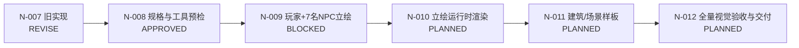

# 《溪谷新芽》每日任务台账 — 2026-08-21

> Product Owner：用户  
> 项目根目录：`/Users/fengyifan/Documents/VibeCoding`  
> 状态唯一来源：[`docs/game/project-ledger.md`](project-ledger.md)

## 1. 当前进度

- 任务总数：36
- 排除 `deferred` 后：35
- 已验收：30
- 当前未完成任务：5（N-007 为 `revise`；N-009 为 `blocked`；N-010～N-012 为 `planned`）
- 进度：`[█████████░] 86%`（30/35，四舍五入）
- 当前阶段：N1 下一轮·表现层（`active`）

## 2. 今日唯一推荐任务

| 任务 | 状态 | 负责人 | 依赖预检 | 目标 |
|---|---|---|---|---|
| N-009 | `blocked / BLOCKED` | 🎨 `art` / 🎭 `content` | 失败：ImageGen 两次输出 1024×1024 RGB、无 Alpha | 等 Product Owner 决定可用工具或新的处理合同；不得启动 N-010 |

当前没有可启动的开发任务。N-009 被 `RSK-008` 阻塞；不得将 32×48 运行时小图放大冒充立绘，也不得在工具决策前重试生产。

## 3. 串行任务链

## 4. 门禁与分工

| 任务 | 专项负责人 | 部门质量负责人 | 当前门禁 | 下一步 |
|---|---|---|---|---|
| N-007 | 🎮 gameplay | 🛡️ quality | `REVISE` | 保留为回退基线；不跳过新立绘规格与生产 |
| N-008 | 🎬 director | 🛡️ quality | `APPROVED` | 已完成；N-009 进入独立开工预检 |
| N-009 | 🎨 art | 🎭 content | `BLOCKED` | 等 Product Owner 决定真透明 RGBA 工具或新的处理合同 |
| N-010 | 🧱 tech | 🛡️ quality | `PENDING` | 等 N-009 `APPROVED` 后接入对话卡与角色信息展示 |
| N-011 | 🎨 art | 🎭 content | `PENDING` | 等 N-010 `APPROVED` 后只做一个建筑/场景样板 |
| N-012 | 🛡️ quality | 📦 release | `PENDING` | 等 N-010、N-011 均完成后做整包回归与交付 |

## 5. 开放风险与产品约束

- `RSK-007`：PRD-NFR-011 断网专项证据尚未执行。按 DEC-018 后置为正式发布前必补，不能用在线预演替代。
- N-006 已完成正式运行时资产与候选资产整包验收；候选包不得自动进入正式运行时内容。
- N-007 的 `REVISE` 原因是当前呈现仍被 Product Owner 认定为粗糙小尺寸像素角色；默认收起 HUD 不能替代精美立绘验收。
- 立绘生产必须保留原创性、透明 PNG、尺寸/Alpha、生成记录和逐项目检记录；概念图、立绘源图与运行时小图必须分层管理。

## 6. 今日完成定义

- 解决 RSK-008：确定并验证可输出 2048×2048 真透明 RGBA 的工具或经批准的自动处理合同。
- 🛡️ quality 返回明确的 `APPROVED`、`REVISE` 或 `BLOCKED`，不得使用模糊批准。
- 在 RSK-008 解决前不生产立绘、不改 Swift、不接入正式 Assets、不改变领域规则或存档 schema。
- 完成后将 N-009 的证据、门禁结果和下一负责人追加回 [`project-ledger.md`](project-ledger.md)。
