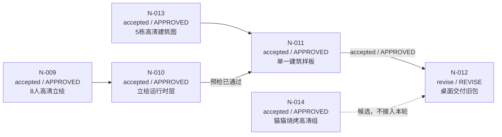

# 《溪谷新芽》N1 任务台账 — 2026-08-22

> Product Owner：用户  
> 状态唯一来源：[`project-ledger.md`](project-ledger.md)  
> 本文件是可视化交接快照，不替代主台账，不自行改变任务状态。

> **2026-08-23 优先级更新：** Product Owner 已通过 DEC-031 将本快照中的 N-012 交付复闸暂停。当前串行顺序改为 `N-015 全量运行时美术/HUD → N-016 原创音乐/环境/音效 → N-012 最终验收与桌面交付`；准确状态以主台账为准。

## 当前结论

N-009、N-010、N-011、N-013、N-014 已完成并通过相应门禁；N-007 已由 N-010 的独立证据闭环。N-011 已 `accepted / APPROVED`。N-012 的 Release 桌面包已重建并通过严格签名校验，当前等待 Hermes r2 复闸。

## 可视化任务表

| 顺序 | Task ID | 状态 / 门禁 | 目标结果 | 专项负责人 | 部门质量负责人 | 现在能否执行 | 下一动作 |
|---:|---|---|---|---|---|---|---|
| 1 | N-011 | `accepted / APPROVED` | 木构农舍高清展示层样板已接入，不改变地图/碰撞/交互 | 🎨 art / Cursor | 🎭 content + Hermes | 已完成 | 不再重复开发 |
| 2 | N-012 | `revise / REVISE` | 全量回归通过；Release 桌面包已重建 | 🛡️ quality / Hermes | 📦 release，🎬 director 复核 | **等待复闸**；新包已安装并通过 codesign | Hermes r2 复闸 → director → PO |
| — | N-007 | `accepted / APPROVED` | HUD 默认收起与高清角色呈现缺口已由 N-010 证据闭环 | 🎮 gameplay / Codex | 🛡️ quality / Hermes | 已完成 | 不再重复开发 |
| — | N-010 | `accepted / APPROVED` | 对话卡/信息页显示 8 名完整高清立绘，I/Q 路由与回退通过 | 🧱 tech / Codex | 🛡️ quality / Hermes | 已完成 | 作为 N-011 依赖 |
| — | N-013 | `accepted / APPROVED` | 5 栋独立 2048×2048 RGBA 高清建筑图 | 🎨 art | 🎭 content + 🛡️ quality | 已完成 | 作为 N-011 只读输入 |

## 门禁与证据要求

| 环节 | 必须返回 | 不允许 |
|---|---|---|
| Codex N-011 预检 | 依赖逐项结果、边界审计、`active / PENDING` 登记证据 | 将 `active` 误报为完成；自签质量门禁 |
| Cursor N-011 交付 | 选型、资源 manifest、尺寸/Alpha/SHA-256、真实页面截图、交接报告 | 修改 Domain、存档、经济、地图拓扑、碰撞、NPC 行为；批量接入五栋建筑 |
| 🎭 content 门禁 | `APPROVED` / `REVISE` / `BLOCKED` | 只看文件名不看资产与截图；把概念图批准扩大为运行时批准 |
| Hermes N-011/N-012 | 独立运行证据、XCTest、截图、存读/输入/回归、版本一致性；明确门禁结果 | 修改实现；用静态阅读代替运行验收；把 N-011 未通过时的 N-012 当作可执行 |

## 共享硬边界

- 高清展示层与地图运行层分离；不得替换既有 `32×48` 角色 sprite 或像素建筑资产。
- N-011 只选一栋：木构农舍、铜闸水工坊、种源棚、巡护亭、苔石埠头之一。
- 不新增角色、稳定 ID、剧情、配方、地图区域、碰撞规则、存档字段或经济规则。
- 任何缺依赖、运行环境不可用、证据不是同一候选构建、或文件越界，均返回 `BLOCKED`；可修复缺陷返回 `REVISE`。
- N-012 仍须保留发布前离线烟雾与 Developer ID 签名/公证风险，不因视觉任务通过而自动清除。

## 推荐顺序

1. Codex：已完成 N-011 依赖预检；N-011 已由 Hermes 复核并登记为 `accepted / APPROVED`。
2. Cursor：N-011 单一木构农舍样板已交付；不再扩展其余四栋。
3. 📦 release：已从当前工作树生成无测试插件的 Release 桌面包，旧包已备份，资源、版本、SHA-256 与签名已记录。
4. Hermes：现在对新桌面包复闸 N-012；通过后交 🎬 director 结项与 Product Owner 终批。
