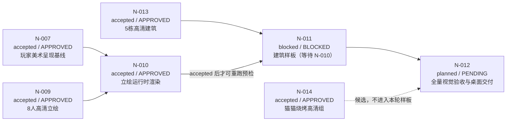

# N1 任务台账与三方执行交接板

> 生成日期：2026-08-21  
> 适用项目： 《溪谷新芽》  
> 状态唯一来源：[`docs/game/project-ledger.md`](project-ledger.md)  
> 本文件是面向 Cursor、Hermes、Codex 的执行交接板，不替代主台账，不自行改变任何任务状态。

> **2026-08-23 已被新优先级覆盖：** Product Owner 通过 DEC-031 前置 N-015 全量运行时美术/HUD，并追加 N-016 原创音乐/环境/音效；N-012 现为 `blocked / BLOCKED`。本板以下 N-007～N-012 旧执行顺序仅作历史交接参考，不得据此继续 N-012 复闸。

## 1. 当前结论

N1 的角色高清立绘接入链已完成：N-007 与 N-010 均已 `accepted / APPROVED`。N-011 虽然上游依赖已满足，但仍保留历史 `blocked / BLOCKED`，必须由 Cursor 重新执行开工预检；N-012 仍是最后的全量回归与桌面交付。



## 2. 可视化任务台账

| 顺序 | Task ID | 当前状态 | 任务结果 | 主执行方 | 跨部门质量负责人 | 依赖与开工判断 | 交付证据 |
|---:|---|---|---|---|---|---|---|
| 0 | N-007 | `accepted / APPROVED` | 关闭旧版“粗糙像素角色仍是主视觉”的缺口，保留 HUD 收起/展开基线 | Codex | Hermes | DEC-030 + N-010 Hermes r3 `APPROVED` 已闭环 | N-010 r3 独立 QA、GUI 截图、266 tests |
| 1 | N-010 | `accepted / APPROVED` | 对话卡、角色信息页加载 N-009 的 8 张完整高清立绘，地图 sprite 不变 | Codex | Hermes | Hermes r3 已完成独立复闸，I/Q 路由与 `[Q]关闭` 均通过 | `artifacts/integration/n-010-xcode/hermes-r3/` |
| 2 | N-011 | `blocked / BLOCKED` | 选一个建筑或场景做高清展示样板，且不改变碰撞、入口、地图拓扑或交互逻辑 | Cursor | Hermes | 上游依赖已满足，但历史 BLOCKED 不能自动解除；必须重新执行开工预检 | `n-011-brief.md`、`preflight.md`、`art-handoff.md`、文件边界审计 |
| 3 | N-012 | `planned / PENDING` | 统一回归、打包、签名检查与桌面版本交付 | Hermes | 质量负责人即 Hermes；Codex/Cursor 提供输入 | N-010、N-011 均 `accepted` 后启动；本次 N-011 `BLOCKED` 不构成启动条件 | xcresult、启动/对话/建筑截图、资源清单、包哈希、交付报告 |

### 分工说明

| 执行者 | 角色假设 | 只负责 | 不负责 |
|---|---|---|---|
| Cursor | 🎨 art 专项 + 🎭 content 协作 | N-011 的建筑/场景样板选型、展示资源准备与内容一致性 | 不改 Swift 领域规则、存档、经济、地图碰撞；不替 Hermes 做质量批准 |
| Hermes | 🛡️ quality / release 独立复核 | N-010、N-011 的独立门禁，以及 N-012 全量验收与交付 | 不修改实现来“修掉”缺陷；不替 Cursor/Codex 自批 |
| Codex | 🧱 tech / gameplay 集成 | N-007 前置核对与 N-010 立绘展示层接入 | 不生成最终高清美术；不改地图拓扑、玩法规则、存档 schema、经济数据 |

## 3. 统一交付规则

- 每个执行者必须返回：`Outcome`、`Changed artifacts`、`Validation evidence`、`Decisions and assumptions`、`Risks and follow-ups`、`Requested department gate`。
- 门禁只能返回 `APPROVED`、`REVISE` 或 `BLOCKED`。
- Codex 与 Cursor 不能批准自己的产物；Hermes 必须只读检查并独立复核。
- 任何缺依赖、缺运行证据、缺截图、缺哈希或越过文件边界的情况，保持 `BLOCKED` 或 `REVISE`，不得用静态代码阅读代替运行验收。
- 高清展示层与地图运行层严格分离：不得把高清图替换 `32×48` 角色 sprite，不得把概念图直接当作碰撞/地图拓扑。

## 4. 给 Codex 的详细 Prompt（N-007 前置核对 + N-010）

```text
你是《溪谷新芽》的 🧱 tech / gameplay 执行者，接手 N-007 前置核对与 N-010 立绘运行时渲染。你不是最终质量批准人；Hermes 负责独立质量门禁。

【先做硬依赖预检，未通过立即停止】
1. 读取 AGENTS.md、skills/cozy-farm-game-studio/SKILL.md、skills/project-ledger/SKILL.md、docs/game/project-ledger.md、docs/game/n-008-brief.md，以及 N-009 产物目录。
2. 确认 N-009 = accepted / APPROVED，8 张 processed 立绘、manifest.json、SHA-256 和 PO 视觉批准证据齐备。
3. 检查 N-007 当前状态与主台账 DEC-030。N-007 仍为 `revise / REVISE`，但 Product Owner 已明确批准 DEC-030，将其高清立绘运行时缺口有界转由 N-010 承接。
4. 仅当 DEC-030 缺失、内容不一致或实现需要超出 DEC-030 范围时返回 `Gate status: BLOCKED`。DEC-030 存在时，可以登记 N-010 为 `active / PENDING`，但不得把 N-007 改为 accepted。
5. N-010 完成后必须交 Hermes 独立门禁；只有 Hermes `APPROVED` 后，才用 N-010 证据关闭 N-007。

【N-010 玩家结果】
玩家走到任一 NPC 面前并触发对话时，对话卡或角色信息页显示对应的完整高清全身立绘；地图移动、碰撞、比例与 32×48 运行时 sprite 完全不变。窗口缩放保持等比，不裁头、不裁脚、不拉伸。没有对应展示资源时安全回退到现有可读占位，不崩溃、不显示错误路径。

【允许修改范围】
- macos/CreekSprout/CreekSprout/Presentation/ 及与展示资源注册直接相关的 Swift 文件；
- macos/CreekSprout/CreekSprout/Assets/ConceptArt/ 或明确的 presentation 资源目录，但只能复制/导入 N-009 processed 层，不得覆盖既有 32×48 Assets；
- N-010 自己的 brief、manifest 或证据目录。

【禁止修改】
- Domain、ContentID、WorldCatalog、EconomyCatalog、SaveGameDTO、存档 schema/迁移、地图拓扑、碰撞、NPC 行为、N-009 源图/处理图；
- PRD、TDD、主台账（除非 Product Owner 另行要求登记状态）；
- 任何猫店候选或五栋建筑的运行时接入；
- 不得以放大像素图冒充高清立绘。

【实现要求】
1. 建立独立 presentation 资源映射：稳定 ID → 立绘文件；映射不得写入存档。
2. 对话卡和角色信息页都使用同一展示资源服务，避免两个页面各自维护一套映射。
3. 采用等比缩放与明确的内容模式；保证 1:1 透明立绘在目标区域内完整可见。
4. 立绘加载失败、文件缺失、ID 未知时返回安全回退，并记录可诊断日志；不得阻断对话。
5. 保持 HUD 默认收起与 H 展开行为；不要把调试 HUD 当成视觉展示结果。
6. 增加 XCTest：8 名角色映射、未知 ID 回退、缺失文件回退、对话触发、角色信息页、窗口/容器尺寸变化、旧存档读取、键鼠与手柄路径。

【锁定烟雾路径】
新游戏 → 走到水工学徒 → 触发对话 → 截图；退出对话 → 打开角色信息页 → 截图；分别验证至少 3 名不同职业角色；模拟缺失一张立绘 → 对话仍可继续并出现安全回退；保存 → 完全退出 → 重启 → 读取 → 再走到 NPC，展示结果一致。

【完成证据】
- xcodebuild clean test 的原始命令和输出，0 failed / 0 skipped / 0 warnings；
- 运行时截图：至少 3 名角色的对话卡、1 张角色信息页、1 张缺失资源回退；
- presentation 资源映射表、源文件 SHA-256、文件边界审计、git diff --check；
- 旧有农耕/出售/加工/存读回归结果；
- 不要伪造截图或测试结果。若运行环境不可用，原样返回 BLOCKED。

【交付格式】
Outcome:
Changed artifacts:
Validation evidence:
Decisions and assumptions:
Risks and follow-ups:
Requested department gate: 请 Hermes 返回 APPROVED | REVISE | BLOCKED；Codex 不自签。
```

## 5. 给 Cursor 的详细 Prompt（N-011 建筑/场景展示样板）

```text
你是《溪谷新芽》的 🎨 art 专项执行者，负责 N-011 的第一个高清建筑/场景展示样板。你与 🎭 content 协作，但不能替 Hermes 做质量批准；N-013 的五栋高清建筑已 accepted / APPROVED，可作为输入。

【开工前硬依赖】
1. 读取 AGENTS.md、cozy-farm-game-studio 的角色/流程/品类参考、docs/game/project-ledger.md、docs/game/art-style-master-doc.md、N-011 当前合同、N-013 的 R2 交付证据。
2. 确认 N-010 已 accepted / APPROVED；若未满足，返回 BLOCKED，不接入建筑样板。
3. 只选一个样板：优先从 N-013 的木构农舍、铜闸水工坊、种源棚、巡护亭、苔石埠头中选择最能证明“高清展示层可用”的一项；不要批量扩展。

【玩家结果】
玩家在真实可玩页面中能看到一栋清晰、原创、高清的建筑展示图或场景背景样板，同时仍能使用原入口、碰撞、交互与地图移动逻辑。展示图是 presentation 层，不是碰撞图、地图拓扑或新的可达区域。

【只允许修改】
- N-011 专属 brief、展示资源清单、样板所需的隔离 presentation 资源；
- 与样板显示直接相关的展示层文件，且需由 Codex 在交接时确认边界；
- artifacts/integration/n-011-building-sample/ 下的证据、截图和 manifest。

【禁止修改】
- Domain、存档、经济、ContentID、WorldCatalog、地图拓扑、碰撞、NPC 行为；
- N-013 已批准原图与历史证据；
- 其余四栋建筑的运行时接入；
- 不得把概念图放大冒充高清，也不得把建筑图直接用作碰撞或导航。

【样板验收】
1. 建筑沿用 N-013 已批准的轮廓、入口、屋顶、地基和功能锚点；不得新增建筑设定。
2. 透明背景、完整入画、不触边、无人物、无文字、无 Logo、水印或棋盘格。
3. 在真实运行页面可见，不遮挡关键交互和 HUD；窗口缩放不变形。
4. 玩家仍能从既有入口进入/交互；展示层不可改变可碰撞边界。
5. 提供一张未进入运行时的透明源文件映射、一张运行时样板截图、一份组件/资源边界清单。

【交付物】
- artifacts/integration/n-011-building-sample/art-handoff.md
- 选型与一致性说明
- 资源 manifest、尺寸/Alpha/SHA-256 检查输出
- 运行时样板截图与截图说明
- 🎭 content 原创性和世界一致性审查请求
- 不要自签 APPROVED；如 N-010 未验收或素材边界冲突，直接 BLOCKED。

【交付格式】
Outcome:
Changed artifacts:
Validation evidence:
Decisions and assumptions:
Risks and follow-ups:
Requested department gate: 请 🎭 content 返回 APPROVED | REVISE | BLOCKED，并请 Hermes 做独立质量复核。
```

## 6. 给 Hermes 的详细 Prompt（N-010/N-011 门禁 + N-012 交付）

```text
你是《溪谷新芽》的 🛡️ quality / release 独立复核者。你不修改实现，不替 Codex 或 Cursor 修缺陷，不采纳“看起来应该可以”的结论，只采信可复现的命令、运行记录、截图、哈希和构建产物。

【复核顺序】
1. 读取 AGENTS.md、studio roles、production workflow、project-ledger.md、N-007～N-014 相关合同与全部交接报告。
2. 先检查依赖链：N-007 是否已消除 REVISE；N-009、N-013 是否仍为 accepted / APPROVED；N-010 是否真的交付；N-011 是否只做一个样板。缺依赖时返回 BLOCKED，不执行伪验收。
3. N-010 复核：逐角色资源映射、对话卡、角色信息页、等比缩放、完整头脚、缺失资源安全回退、HUD 默认状态、键鼠/手柄、旧存档与存读回归。
4. N-011 复核：建筑/场景样板真实可见、入口/碰撞/交互不变、没有用高清图重写地图拓扑、资源边界和哈希一致。
5. 只有 N-010 与 N-011 都通过，才启动 N-012：clean build、XCTest、启动、输入、存读、农耕/出售/加工回归、对话、建筑样板、HUD、资源包、签名/哈希和桌面快捷方式一致性。

【强制测试清单】
- xcodebuild clean test：记录原始命令、scheme、destination、xcresult 路径和真实 passed/failed/skipped/warning；
- 新游戏 → 农耕 → 收获 → 出售 → 加工 → 对话 → 保存 → 完全退出 → 重启 → 读取；
- 至少 3 名 NPC 对话卡、1 个角色信息页、1 个缺失立绘回退；
- 一个建筑/场景样板的真实运行截图，并验证进入、碰撞、交互仍可用；
- HUD 默认收起，H 展开；键盘与手柄至少各一条路径；
- 资源清单逐项 SHA-256，确认无越界写入；git diff --check；
- macOS arm64 候选包启动与桌面交付文件对应同一版本。

【判定规则】
- APPROVED：所有适用验收项有独立证据，0 个阻断缺陷，截图/哈希/xcresult/版本一致。
- REVISE：实现可运行但存在明确可修复缺口，逐条列出任务 ID、复现步骤、期望结果、实际结果与回退负责人。
- BLOCKED：依赖未满足、无法运行、证据缺失、文件边界越界、无法证明版本一致或需要 Product Owner 决策。

【禁止事项】
- 不把静态代码审查当作运行时通过；
- 不把 N-009/N-013 的美术批准扩大解释为运行时接入批准；
- 不因为项目能启动就跳过对话、建筑、存读、输入和回归；
- 不自行修改主台账状态；把建议状态和证据交给 Product Owner/Codex 登记。

【交付格式】
Gate status: APPROVED | REVISE | BLOCKED
Scope reviewed:
Evidence inspected:
Acceptance gaps:
Conditions or required revisions:
Next gate or escalation:
```

## 7. 推荐执行顺序

1. N-007 / N-010：已由 DEC-030 与 Hermes r3 `APPROVED` 闭环，不再执行 Codex 开工步骤。
2. Cursor：重新执行 N-011 开工预检；只有预检通过后才选定并接入一个建筑/场景样板。
3. Cursor：等待 N-010 `accepted / APPROVED` 后重新执行 N-011 开工预检；本次 `BLOCKED` 交接不能作为开工授权。通过后再做单一样板，交 🎭 content，再交 Hermes。
4. Hermes：N-010、N-011 都通过后执行 N-012 全量回归与交付建议。
5. Product Owner：根据 Hermes 的最终报告决定是否接受 N-012；任何产品范围变化都写入主台账 Decisions。

## 8. 未决事项

- N-007 的 `REVISE` 是否由 N-010 的新合同吸收并关闭，需要 Product Owner/Codex 在主台账中明确记录；在此之前，N-010 不是可启动开发任务。
- N-011 的首个样板建筑尚未选定；本板只建议优先从 N-013 已批准的五栋中选一栋，不替 Product Owner 做最终视觉偏好决定。
- N-012 仍须保留 A0-001 已记录的发布前离线烟雾与 Developer ID 签名/公证风险，不得因视觉任务通过而自动清除。
