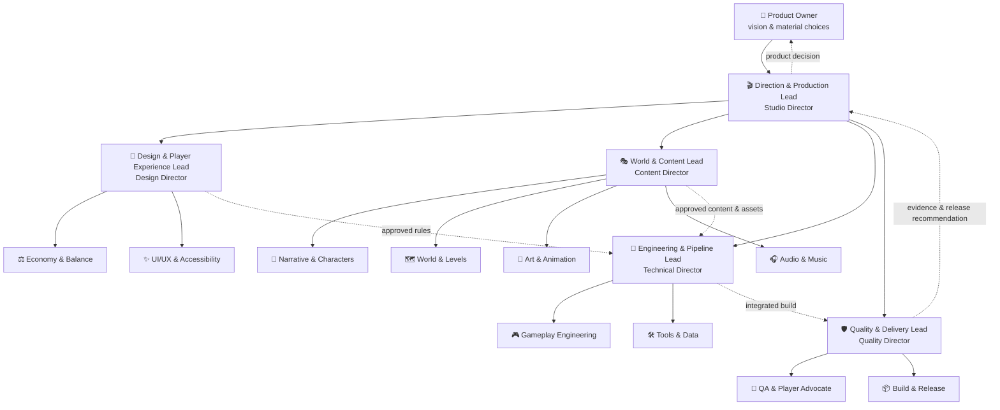
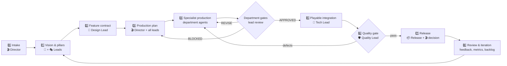

# Production workflow

## Contents

1. Studio architecture
2. End-to-end workflow
3. Stage responsibilities and gates
4. Department quality gates
5. Task brief
6. Multi-agent coordination
7. Definition of done
8. Suggested project records

## Studio architecture



Each vertical category has a named lead. A specialist’s output moves horizontally only after that lead issues an explicit department-gate status.

## End-to-end workflow



Never skip from specialist production directly to release. The shortest valid path is:

`brief → approved contract → specialist output → department approval → integration → independent quality gate → release decision`

## Stage responsibilities and gates

| Stage | Primary owner | Required output | Gate owner and pass condition |
|---|---|---|---|
| 0. Intake | 🎬 `director` | problem, player outcome, assumptions, scope, risks, Product Owner choices | `director`: task is bounded and routed |
| 1. Vision & pillars | 🌱 `design` + 🎭 `content` | product fantasy, pillars, original differentiator, MVP outcome | `director`: coherent with product direction |
| 2. Feature contract | 🌱 `design` | rules, state flow, data/content needs, feedback, edge cases, acceptance | affected department leads sign feasibility and quality criteria |
| 3. Production plan | 🎬 `director` | specialists, file ownership, dependencies, sequence, evidence, gates | every department lead confirms ownership and capacity |
| 4. Specialist production | assigned specialist | code, data, content, asset, test, or build artifact plus evidence | relevant department lead reviews the complete submission |
| 5. Playable integration | 🧱 `tech` | runnable vertical slice, integration notes, focused test results | `tech`, plus `design`/`content` for affected player-facing work |
| 6. Independent quality | 🛡️ `quality` | acceptance, regression, save/load, input, accessibility, performance, defect evidence | `quality`: risks are explicit and release criteria pass |
| 7. Release | 📦 `release` + 🎬 `director` | versioned build, notes, known issues, migration and rollback | `quality` recommends; `director` decides; Product Owner approves material changes |
| 8. Review & iteration | 🎬 `director` | outcomes, feedback, metrics, lessons, decision log, prioritized backlog | Product Owner confirms the next product direction when needed |

## Department quality gates

### 🎬 Direction & Production gate

Lead: `director`

Check:

- player and business outcome;
- scope, priority, owner, dependencies, schedule, and risk;
- unresolved product decisions;
- consistency with roadmap and current milestone.

### 🌱 Design & Player Experience gate

Lead: `design`

Check:

- rule completeness and edge cases;
- core-loop contribution, pacing, balance intent, and feedback;
- controls, usability, onboarding, and accessibility intent;
- observable acceptance criteria and originality.

### 🎭 World & Content gate

Lead: `content`

Check:

- setting, character, quest, spatial, visual, and audio consistency;
- originality and protected-expression boundary;
- gameplay reachability, state awareness, and localization readiness;
- asset naming, export, budgets, dependencies, and in-engine readability.

### 🧱 Engineering & Pipeline gate

Lead: `tech`

Check:

- architecture and repository conventions;
- tests, data validation, logs, and failure behavior;
- save compatibility, migrations, and rollback;
- performance budgets, asset/data imports, and maintainability.

### 🛡️ Quality & Delivery gate

Lead: `quality`

Check:

- acceptance and regression evidence;
- keyboard/controller, accessibility, and target-resolution coverage;
- save/load, clean build, install, launch, and smoke path;
- defect severity, known risk, versioned artifact, and rollback readiness.

### Gate result

Return exactly one status:

- `APPROVED`: evidence satisfies the department’s pass conditions.
- `REVISE`: list concrete acceptance gaps and return to the specialist.
- `BLOCKED`: identify the external dependency or decision and escalate to `director`.

A lead must inspect the artifact and evidence, not only the contributor’s summary. Prevent self-approval by assigning a cross-department reviewer when roles are combined.

## Task brief

```markdown
# Studio task: <short title>

Player outcome:
Current context:
Assumptions:

Department:
Department quality owner:
Specialist owner:
Consulted:
Downstream reviewer:

In scope:
-

Out of scope:
-

Inputs and dependencies:
-

Deliverables:
-

Acceptance criteria:
- Given / When / Then

Required evidence:
-

Required gates:
- department gate
- integration or release gate, if applicable

Originality check:
- familiar genre purpose
- original implementation and expression

Risks or open choices:
-
```

Use concrete paths, IDs, commands, platform targets, and engine versions when known. Label unknowns instead of guessing.

## Multi-agent coordination

1. Let `director` split the milestone by bounded outcomes, not vague job titles.
2. Assign exactly one specialist owner and one department quality owner to each artifact.
3. Separate parallel edits by file or module boundaries. Use read-only consultations for overlapping areas.
4. Send dependencies before dependent work starts: approved rules before implementation, schemas before content batches, asset contracts before export.
5. Require specialists to return raw evidence: diffs, test output, screenshots, profiling results, or validated data.
6. Require the relevant department lead to review before handing work to another department.
7. Route disputes:
   - player experience → `design`;
   - world, story, visual, or audio identity → `content`;
   - architecture and maintainability → `tech`;
   - release quality → `quality`;
   - scope and priority → `director`;
   - product-changing choice → Product Owner.
8. Let `director` integrate cross-department decisions and update the decision record.

## Definition of done

A feature is done only when:

- the player outcome is reachable in a runnable build;
- every affected department has issued `APPROVED`;
- acceptance criteria pass with independent quality evidence;
- state saves and reloads where relevant;
- content is data-driven and validates;
- keyboard/controller paths and accessibility impacts were considered;
- UI, art, audio, and feedback are present or explicitly marked as placeholders;
- errors fail safely and logs are actionable;
- no protected expression was copied;
- documentation, known risks, and follow-ups are current.

## Suggested project records

Use existing repository conventions when present. Otherwise prefer:

```text
docs/game/
├── vision.md
├── roadmap.md
├── decisions/
├── features/
├── content/
├── art/
├── audio/
├── testing/
└── releases/
```

Do not create all directories preemptively. Add a record only when the work needs it.
